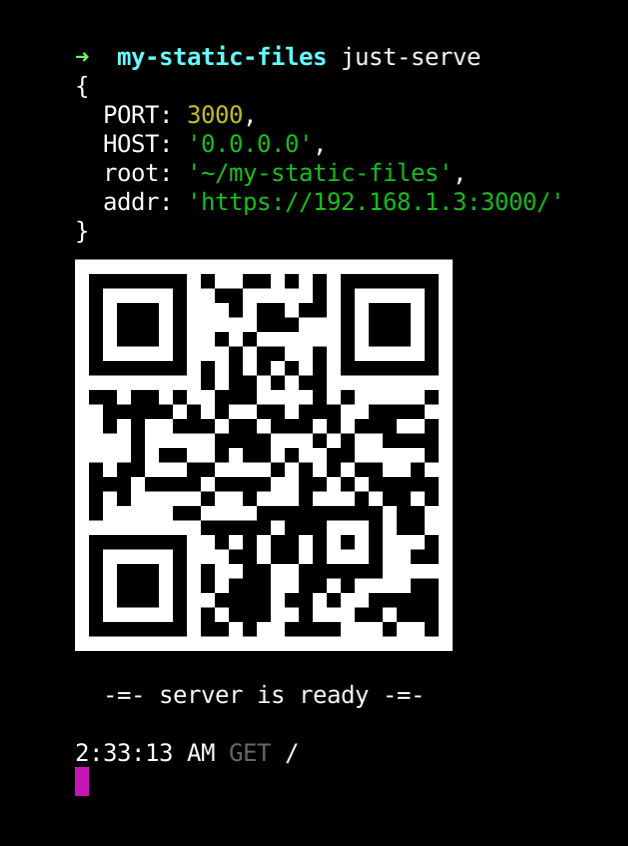

# just-serve

cli tool to just serve a directory using https



## Installation

```sh
$ npm install just-serve -g
```

## Usage

```sh
# serves cwd
just-serve

# serve a given path
just-serve my/path

# serve with given host/port
HOST=localhost PORT=7777 just-serve
```

## License

MIT
